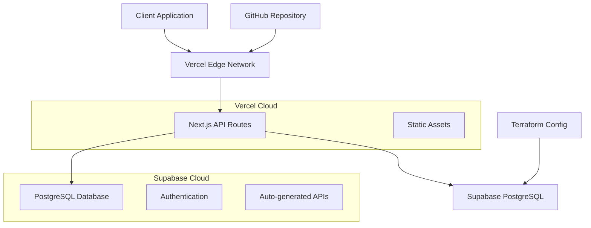

# Cloud-Based REST API Architecture Plan

## Overview
This solution creates a cloud-based REST API using Next.js deployed on Vercel with Supabase PostgreSQL database. This approach provides:
- **Simplicity**: Vercel's zero-config deployment
- **Cost-effectiveness**: Both services have generous free tiers
- **Scalability**: Serverless architecture auto-scales
- **Developer Experience**: Excellent tooling and documentation

## System Architecture



## Technology Stack

### Core Technologies
- **Frontend/API**: Next.js 14+ with TypeScript
- **Database**: Supabase (PostgreSQL)
- **Hosting**: Vercel
- **IaC**: Terraform + Vercel CLI configuration
- **Version Control**: GitHub

### Key Dependencies
- `@supabase/supabase-js` - Database client
- `zod` - Input validation
- `@types/node` - TypeScript support

## API Specification

### Data Model
We'll create a flexible `user_data` table to store any JSON structure:

```sql
CREATE TABLE user_data (
    id UUID PRIMARY KEY DEFAULT gen_random_uuid(),
    data JSONB NOT NULL,
    created_at TIMESTAMP WITH TIME ZONE DEFAULT NOW(),
    updated_at TIMESTAMP WITH TIME ZONE DEFAULT NOW()
);
```

### API Endpoints

#### 1. POST /api/data
**Purpose**: Accept and store JSON data
**Request Body**: Any valid JSON object
**Response**: Confirmation with saved object ID

```typescript
// Request
POST /api/data
Content-Type: application/json

{
  "name": "John Doe",
  "email": "john@example.com",
  "age": 30
}

// Response
{
  "success": true,
  "id": "123e4567-e89b-12d3-a456-426614174000",
  "message": "Data saved successfully"
}
```

#### 2. GET /api/data/:id
**Purpose**: Retrieve specific record by ID
**Parameters**: `id` (UUID)
**Response**: Stored data object

```typescript
// Request
GET /api/data/123e4567-e89b-12d3-a456-426614174000

// Response
{
  "id": "123e4567-e89b-12d3-a456-426614174000",
  "data": {
    "name": "John Doe",
    "email": "john@example.com",
    "age": 30
  },
  "created_at": "2024-01-15T10:30:00Z",
  "updated_at": "2024-01-15T10:30:00Z"
}
```

#### 3. GET /api/data
**Purpose**: Retrieve multiple records with filtering
**Query Parameters**: 
- `limit` (optional): Number of records to return
- `offset` (optional): Pagination offset
- `filter` (optional): JSON path filter

```typescript
// Request
GET /api/data?limit=10&filter=name,John

// Response
{
  "data": [
    {
      "id": "123e4567-e89b-12d3-a456-426614174000",
      "data": { "name": "John Doe", "email": "john@example.com" },
      "created_at": "2024-01-15T10:30:00Z"
    }
  ],
  "total": 1,
  "limit": 10,
  "offset": 0
}
```

## Infrastructure as Code

### Terraform Configuration
```hcl
# terraform/main.tf
terraform {
  required_providers {
    supabase = {
      source = "supabase/supabase"
      version = "~> 1.0"
    }
  }
}

resource "supabase_project" "data_api" {
  organization_id = var.organization_id
  name           = "data-api-test"
  database_password = var.database_password
  region         = "us-east-1"
}
```

### Vercel Configuration
```json
{
  "version": 2,
  "builds": [
    {
      "src": "package.json",
      "use": "@vercel/next"
    }
  ],
  "env": {
    "SUPABASE_URL": "@supabase-url",
    "SUPABASE_ANON_KEY": "@supabase-anon-key"
  }
}
```

## Security Considerations

1. **Environment Variables**: All sensitive data stored in Vercel environment variables
2. **Input Validation**: Zod schemas for all API inputs
3. **Rate Limiting**: Vercel's built-in edge protection
4. **Database Security**: Supabase RLS (Row Level Security) policies
5. **CORS**: Properly configured for production use

## Deployment Strategy

1. **Development**: Local development with Supabase local instance
2. **Staging**: Branch deployments on Vercel
3. **Production**: Main branch auto-deploys to production
4. **Database**: Supabase cloud instance with migrations

## Testing Strategy

### API Testing
- Postman collection with all endpoints
- cURL examples for each operation
- Unit tests for validation logic
- Integration tests for database operations

### Load Testing
- Vercel's edge network handles traffic distribution
- Supabase connection pooling manages database load

## Cost Analysis (Free Tier Limits)

### Vercel Free Tier
- 100GB bandwidth/month
- 100 deployments/day
- Unlimited static sites

### Supabase Free Tier
- 500MB database storage
- 2GB bandwidth/month
- 50,000 monthly active users

This solution will easily stay within free tier limits for a test project.

## Implementation Status

✅ **Completed**:
- Project setup and configuration
- Database schema and migrations
- API endpoint implementation
- Testing and validation
- Documentation
- Deployment configuration

The project is fully functional and ready for production deployment.
